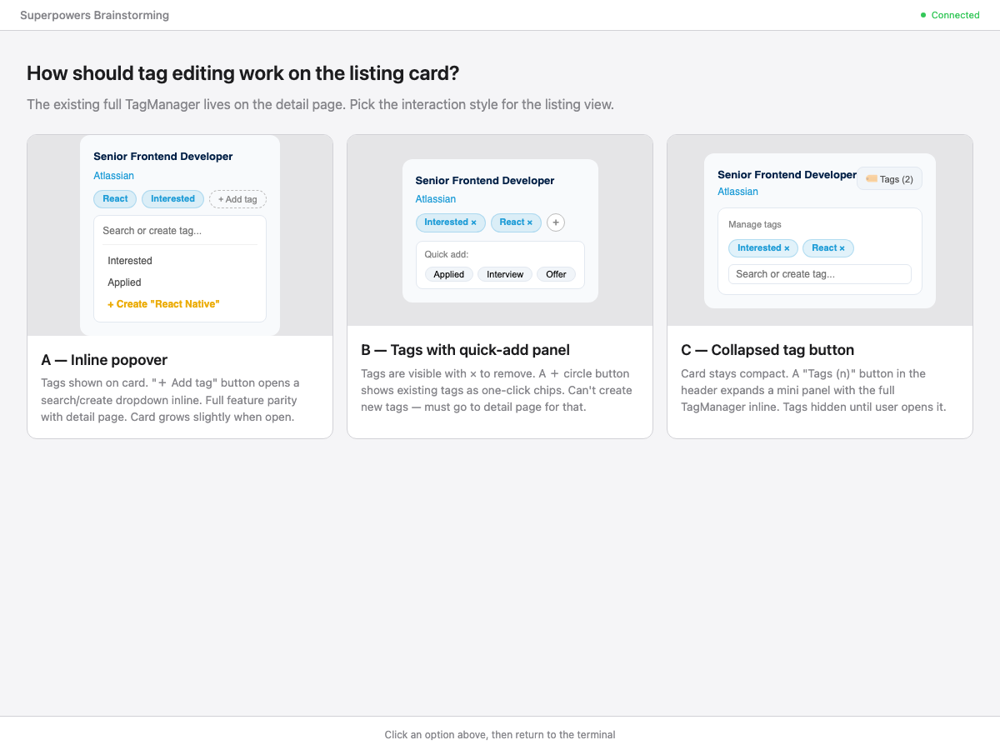
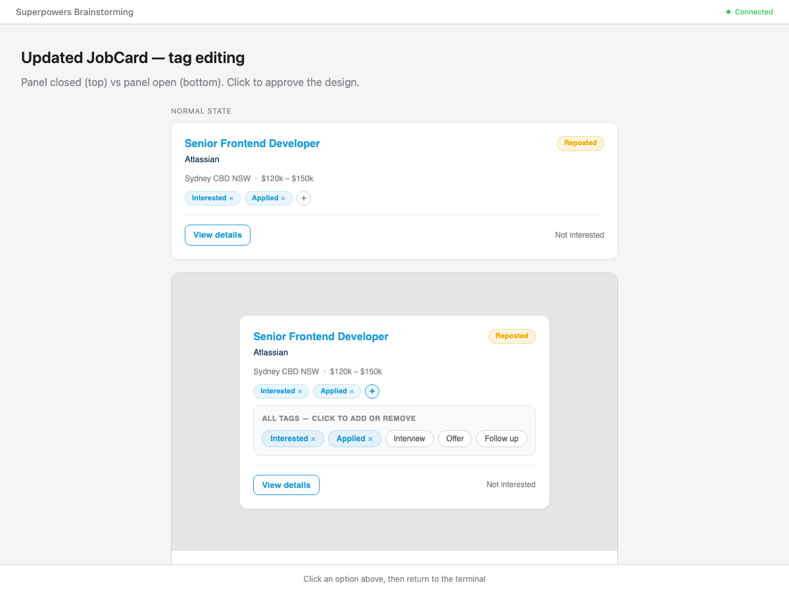

# Tag editing on the job listing page

**Date:** 2026-05-26
**Status:** Approved

## Mockups

### Interaction options considered

### Approved design — card closed and panel open

## Goal

Allow users to add and remove tags directly from the job listing card, without navigating to the job detail page.

## Interaction model

Option B — tags visible on the card with a quick-add panel:

- All tags currently applied to the job are shown as blue chips with a `×` button to remove.
- A `+` circle button sits at the end of the tag row. Clicking it toggles an inline quick-add panel.
- The panel shows the **full set of all tags** in the system as chips:
  - Applied tags: blue (same style as the tag row), with `×` to remove.
  - Unapplied tags: gray/white, click to apply.
- Clicking the `+` button again, or applying/removing a tag, closes the panel.
- New tag creation is not available from the listing — use the detail page for that.

## Architecture

### `JobCard.tsx`

- Add `"use client"` directive (currently a server component; must become a client component to hold state).
- Add `allTags: Tag[]` prop passed from `JobList`.
- Add local state: `tags` (initially `job.tags`), `panelOpen` (boolean).
- Tag removal: `DELETE /api/jobs/{jobId}/tags/{tagId}`, update local `tags`.
- Tag addition: `POST /api/jobs/{jobId}/tags/{tagId}`, update local `tags`.
- The "Interested" special-case badge is replaced by the general tag chip list.

### `JobList.tsx`

- Already fetches `allTags` for the filter dropdown — pass it as a prop to each `JobCard`.
- No new API calls introduced.

## API

No changes. Uses existing endpoints:
- `GET /api/tags` — already called in `JobList`
- `POST /api/jobs/{id}/tags/{tagId}` — add tag to job
- `DELETE /api/jobs/{id}/tags/{tagId}` — remove tag from job

## Files changed

| File | Change |
|------|--------|
| `frontend/components/JobCard.tsx` | Add client state, tag chip row, `+` button, quick-add panel |
| `frontend/components/JobList.tsx` | Pass `allTags` prop to `JobCard` |

## Out of scope

- Creating new tags from the listing page (detail page only).
- Persisting panel open/closed state across renders.
- Tag filtering updates when tags change on a card (list re-fetches on next filter change only).
